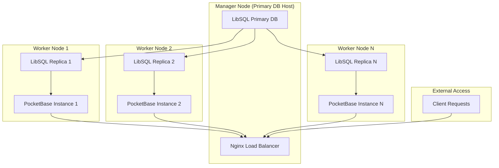

# Docker Swarm Setup for PocketBase-LibSQL Scaling

This guide shows how to deploy the PocketBase-LibSQL architecture using Docker Swarm, ensuring the primary database remains on a designated machine while replicas and PocketBase instances can be distributed across multiple nodes for high availability and scaling.

## Architecture Overview



## Prerequisites

- **3+ Linux machines** (1 manager, 2+ workers)
- **Docker Engine 20.10+** installed on all nodes
- **Network connectivity** between all nodes
- **Shared storage** (NFS, GlusterFS, or similar) for persistent data
- **SSH access** to all machines

## Machine Requirements

### Manager Node (Primary DB Host)

- **CPU**: 4+ cores
- **RAM**: 8+ GB
- **Storage**: SSD with 100+ GB
- **Role**: Hosts primary LibSQL database and load balancer

### Worker Nodes (Replica + PocketBase)

- **CPU**: 2+ cores per node
- **RAM**: 4+ GB per node
- **Storage**: 50+ GB per node
- **Role**: Host replicas and PocketBase instances

## Step 1: Prepare Shared Storage

Set up shared storage accessible from all nodes for persistent data:

### Option A: NFS Setup

**On NFS Server (Manager Node):**

```bash
# Install NFS server
sudo apt update && sudo apt install -y nfs-kernel-server

# Create shared directories
sudo mkdir -p /nfs/pocketbase/{data,storage,hooks,public,migrations}
sudo mkdir -p /nfs/libsql/{primary,replicas}

# Configure NFS exports
echo "/nfs/pocketbase *(rw,sync,no_subtree_check,no_root_squash)" | sudo tee -a /etc/exports
echo "/nfs/libsql *(rw,sync,no_subtree_check,no_root_squash)" | sudo tee -a /etc/exports

# Start NFS server
sudo systemctl enable nfs-kernel-server
sudo systemctl start nfs-kernel-server
sudo exportfs -ra
```

**On All Worker Nodes:**

```bash
# Install NFS client
sudo apt update && sudo apt install -y nfs-common

# Create mount points
sudo mkdir -p /mnt/nfs/{pocketbase,libsql}

# Mount NFS shares
sudo mount -t nfs <MANAGER_IP>:/nfs/pocketbase /mnt/nfs/pocketbase
sudo mount -t nfs <MANAGER_IP>:/nfs/libsql /mnt/nfs/libsql

# Make mounts persistent
echo "<MANAGER_IP>:/nfs/pocketbase /mnt/nfs/pocketbase nfs defaults 0 0" | sudo tee -a /etc/fstab
echo "<MANAGER_IP>:/nfs/libsql /mnt/nfs/libsql nfs defaults 0 0" | sudo tee -a /etc/fstab
```

## Step 2: Initialize Docker Swarm

### On Manager Node:

```bash
# Initialize swarm
docker swarm init --advertise-addr <MANAGER_IP>

# Get join tokens
docker swarm join-token worker
docker swarm join-token manager  # If you want additional managers
```

### On Worker Nodes:

```bash
# Join the swarm (use token from manager)
docker swarm join --token <WORKER_TOKEN> <MANAGER_IP>:2377
```

### Verify Swarm Status:

```bash
# On manager node
docker node ls
```

## Step 3: Label Nodes for Service Placement

```bash
# Label manager node for primary database
docker node update --label-add role=primary <MANAGER_NODE_ID>

# Label worker nodes for replicas
docker node update --label-add role=replica node1
docker node update --label-add role=replica node2
# ... repeat for additional nodes
```

## Step 4: Create Docker Networks

```bash
# Create overlay networks for service communication
docker network create --driver overlay --attachable pocketbase-network
docker network create --driver overlay --attachable libsql-network
```

## Step 5: Create Docker Stack Configuration

Create `docker-stack.yml`:

```yaml
version: "3.8"

services:
  # Primary LibSQL Database (Always on manager node)
  sqld-primary:
    image: ghcr.io/tursodatabase/libsql-server:latest
    environment:
      - SQLD_NODE=primary
    ports:
      - "8080:8080"
      - "5001:5001"
    volumes:
      - /mnt/nfs/libsql/primary:/var/lib/sqld
    networks:
      - libsql-network
    deploy:
      placement:
        constraints:
          - node.labels.role == primary
      replicas: 1
      restart_policy:
        condition: on-failure
        delay: 5s
        max_attempts: 3
      resources:
        limits:
          memory: 2G
        reservations:
          memory: 1G

  # LibSQL Replicas (Distributed across worker nodes)
  sqld-replica:
    image: ghcr.io/tursodatabase/libsql-server:latest
    environment:
      - SQLD_NODE=replica
      - SQLD_PRIMARY_URL=libsql://sqld-primary:5001
    ports:
      - "8081-8089:8080"
      - "5002-5010:5001"
    volumes:
      - /mnt/nfs/libsql/replicas:/var/lib/sqld
    networks:
      - libsql-network
    depends_on:
      - sqld-primary
    deploy:
      placement:
        constraints:
          - node.labels.role == replica
      replicas: 3 # Adjust based on number of worker nodes
      restart_policy:
        condition: on-failure
        delay: 5s
        max_attempts: 3
      resources:
        limits:
          memory: 1G
        reservations:
          memory: 512M

  # PocketBase Instances (Distributed across worker nodes)
  pocketbase:
    build:
      context: .
      dockerfile: Dockerfile
    environment:
      - DB_PATH=http://sqld-replica:8080
      - DB_AUTH_TOKEN=${DB_AUTH_TOKEN:-}
    ports:
      - "8090-8099:8080"
    volumes:
      - /mnt/nfs/pocketbase/storage:/app/pb_data/storage
      - /mnt/nfs/pocketbase/hooks:/app/pb_hooks
      - /mnt/nfs/pocketbase/public:/app/pb_public
      - /mnt/nfs/pocketbase/migrations:/app/pb_migrations
    networks:
      - pocketbase-network
      - libsql-network
    depends_on:
      - sqld-replica
    deploy:
      placement:
        constraints:
          - node.labels.role == replica
      replicas: 3 # Adjust based on desired scale
      restart_policy:
        condition: on-failure
        delay: 5s
        max_attempts: 3
      resources:
        limits:
          memory: 1G
        reservations:
          memory: 512M

  # Nginx Load Balancer (On manager node)
  nginx:
    image: nginx:alpine
    ports:
      - "8089:80"
    volumes:
      - ./conf/nginx-swarm.conf:/etc/nginx/nginx.conf:ro
    networks:
      - pocketbase-network
    depends_on:
      - pocketbase
    deploy:
      placement:
        constraints:
          - node.labels.role == primary
      replicas: 1
      restart_policy:
        condition: on-failure
        delay: 5s
        max_attempts: 3

  # MinIO S3 Storage (On manager node)
  minio:
    image: minio/minio:RELEASE.2024-04-22T22-12-26Z
    environment:
      MINIO_ROOT_USER: admin
      MINIO_ROOT_PASSWORD: admin123
    ports:
      - "9000:9000"
      - "9001:9001"
    volumes:
      - /mnt/nfs/pocketbase/minio:/data
    command: server /data --console-address ":9001"
    networks:
      - pocketbase-network
    deploy:
      placement:
        constraints:
          - node.labels.role == primary
      replicas: 1
      restart_policy:
        condition: on-failure

networks:
  pocketbase-network:
    external: true
  libsql-network:
    external: true
```

## Step 6: Create Nginx Configuration for Swarm

Create `conf/nginx-swarm.conf`:

```nginx
events {
    worker_connections 1024;
}

http {
    # Upstream for PocketBase services in swarm
    upstream pocketbase_backend {
        # Docker Swarm will handle service discovery
        # These resolve to all healthy replicas
        server pocketbase:8080;
    }

    server {
        listen 80;

        # Health check endpoint
        location /health {
            access_log off;
            return 200 "healthy\n";
            add_header Content-Type text/plain;
        }

        # SSE endpoints
        location /api/realtime {
            proxy_pass http://pocketbase_backend;
            proxy_set_header Host $host;
            proxy_set_header X-Real-IP $remote_addr;
            proxy_set_header X-Forwarded-For $proxy_add_x_forwarded_for;
            proxy_set_header X-Forwarded-Proto $scheme;

            # SSE settings
            proxy_buffering off;
            proxy_cache off;
            proxy_set_header Connection '';

            # Timeouts
            proxy_connect_timeout 120s;
            proxy_send_timeout 120s;
            proxy_read_timeout 120s;

            proxy_set_header Cache-Control 'no-cache';
        }

        # All other requests
        location / {
            proxy_pass http://pocketbase_backend;
            proxy_set_header Host $host;
            proxy_set_header X-Real-IP $remote_addr;
            proxy_set_header X-Forwarded-For $proxy_add_x_forwarded_for;
            proxy_set_header X-Forwarded-Proto $scheme;

            # WebSocket support
            proxy_http_version 1.1;
            proxy_set_header Upgrade $http_upgrade;
            proxy_set_header Connection "upgrade";

            # Timeouts
            proxy_connect_timeout 60s;
            proxy_send_timeout 60s;
            proxy_read_timeout 60s;
        }
    }
}
```

## Step 7: Deploy the Stack

```bash
# Create environment file (optional)
echo "DB_AUTH_TOKEN=your_secure_token_here" > .env

# Deploy the stack
docker stack deploy -c docker-stack.yml pocketbase-cluster

# Verify deployment
docker service ls
docker stack ps pocketbase-cluster
```

## Step 8: Scaling and Management

### Scale Services:

```bash
# Scale PocketBase instances
docker service scale pocketbase-cluster_pocketbase=5

# Scale LibSQL replicas
docker service scale pocketbase-cluster_sqld-replica=4

# Check service status
docker service ps pocketbase-cluster_pocketbase
```

### Update Services:

```bash
# Update PocketBase image
docker service update --image your-registry/pocketbase:latest pocketbase-cluster_pocketbase

# Update with zero downtime
docker service update --update-parallelism 1 --update-delay 30s pocketbase-cluster_pocketbase
```

### Monitor Services:

```bash
# View service logs
docker service logs -f pocketbase-cluster_pocketbase
docker service logs -f pocketbase-cluster_sqld-primary

# Check node resource usage
docker node ps $(docker node ls -q)

# Service inspection
docker service inspect pocketbase-cluster_pocketbase
```

## Step 9: Advanced Configuration

### Auto-scaling with Docker Swarm Mode

Create `autoscaler.sh`:

```bash
#!/bin/bash

# Simple auto-scaler based on CPU usage
while true; do
    # Get average CPU usage across PocketBase services
    CPU_USAGE=$(docker stats --no-stream --format "table {{.CPUPerc}}" | grep -v CPU | sed 's/%//g' | awk '{sum+=$1; count++} END {print sum/count}')

    # Scale up if CPU > 80%
    if (( $(echo "$CPU_USAGE > 80" | bc -l) )); then
        CURRENT_REPLICAS=$(docker service inspect --format='{{.Spec.Mode.Replicated.Replicas}}' pocketbase-cluster_pocketbase)
        NEW_REPLICAS=$((CURRENT_REPLICAS + 1))
        echo "High CPU usage ($CPU_USAGE%), scaling up to $NEW_REPLICAS replicas"
        docker service scale pocketbase-cluster_pocketbase=$NEW_REPLICAS
    fi

    # Scale down if CPU < 30% and more than 2 replicas
    if (( $(echo "$CPU_USAGE < 30" | bc -l) )); then
        CURRENT_REPLICAS=$(docker service inspect --format='{{.Spec.Mode.Replicated.Replicas}}' pocketbase-cluster_pocketbase)
        if [ $CURRENT_REPLICAS -gt 2 ]; then
            NEW_REPLICAS=$((CURRENT_REPLICAS - 1))
            echo "Low CPU usage ($CPU_USAGE%), scaling down to $NEW_REPLICAS replicas"
            docker service scale pocketbase-cluster_pocketbase=$NEW_REPLICAS
        fi
    fi

    sleep 60
done
```

### Health Checks and Recovery

Add health checks to the stack:

```yaml
# Add to each service in docker-stack.yml
healthcheck:
  test: ["CMD", "curl", "-f", "http://localhost:8080/api/health"]
  interval: 30s
  timeout: 10s
  retries: 3
  start_period: 40s
```

## Step 10: Backup and Disaster Recovery

### Automated Backup Script

Create `backup.sh`:

```bash
#!/bin/bash

BACKUP_DIR="/mnt/nfs/backups"
DATE=$(date +%Y%m%d_%H%M%S)

# Create backup directory
mkdir -p $BACKUP_DIR/$DATE

# Backup primary database
docker exec $(docker ps -q -f name=pocketbase-cluster_sqld-primary) \
    sqlite3 /var/lib/sqld/data.db ".backup /tmp/backup_$DATE.db"

docker cp $(docker ps -q -f name=pocketbase-cluster_sqld-primary):/tmp/backup_$DATE.db \
    $BACKUP_DIR/$DATE/primary_db.backup

# Backup PocketBase data
cp -r /mnt/nfs/pocketbase/* $BACKUP_DIR/$DATE/

# Cleanup old backups (keep last 7 days)
find $BACKUP_DIR -type d -mtime +7 -exec rm -rf {} \;

echo "Backup completed: $BACKUP_DIR/$DATE"
```

## Troubleshooting

### Common Issues:

1. **Primary database not accessible:**

   ```bash
   # Check primary node status
   docker node inspect <MANAGER_NODE_ID>

   # Verify primary service
   docker service ps pocketbase-cluster_sqld-primary
   ```

2. **Replicas can't connect to primary:**

   ```bash
   # Check network connectivity
   docker exec -it <REPLICA_CONTAINER> ping sqld-primary

   # Check LibSQL primary logs
   docker service logs pocketbase-cluster_sqld-primary
   ```

3. **Load balancer issues:**

   ```bash
   # Test individual PocketBase instances
   docker service ps pocketbase-cluster_pocketbase

   # Check nginx configuration
   docker exec -it <NGINX_CONTAINER> nginx -t
   ```

### Monitoring Commands:

```bash
# Overall cluster status
docker node ls
docker service ls
docker stack ps pocketbase-cluster

# Resource usage
docker stats

# Service discovery
docker service inspect pocketbase-cluster_pocketbase --pretty
```

## Production Considerations

1. **Security:**

   - Use Docker secrets for sensitive data
   - Enable TLS for all communications
   - Implement network segmentation
   - Regular security updates

2. **Performance:**

   - Monitor resource usage per node
   - Optimize service placement based on workload
   - Use SSD storage for database nodes
   - Implement caching strategies

3. **High Availability:**
   - Deploy multiple manager nodes
   - Use external load balancer for production
   - Implement proper backup strategies
   - Plan for disaster recovery scenarios

This Docker Swarm setup provides a production-ready, scalable architecture for your PocketBase-LibSQL system with proper primary database placement and distributed replicas.
