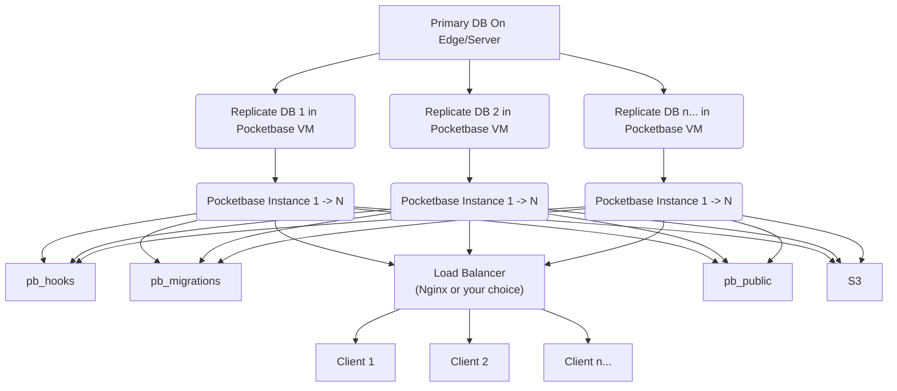

# PocketBase Scaling with LibSQL and sqld - Proof of Concept

This repository demonstrates a scalable architecture for PocketBase using [LibSQL](https://github.com/tursodatabase/libsql) and sqld for distributed database replication and load balancing.

## Overview

This PoC showcases how to horizontally scale PocketBase by leveraging LibSQL's distributed database capabilities. The architecture implements a primary-replica pattern with multiple PocketBase instances connected to replicated databases, all fronted by a load balancer.

## Architecture



### Key Components

1. **LibSQL Primary Database**: The authoritative source of truth running on sqld
2. **LibSQL Replica Databases**: Read replicas that synchronize with the primary
3. **PocketBase Instances**: Multiple PocketBase servers connecting to replica databases
4. **Load Balancer**: Nginx distributing traffic across PocketBase instances
5. **pb_hooks**: Shared custom hooks for PocketBase
6. **pb_public**: Shared public files for PocketBase
7. **pb_migrations**: Shared migrations for PocketBase
8. **MinIO S3**: Object storage for file uploads and static assets

## How LibSQL and sqld Work

This PoC leverages LibSQL's distributed architecture as described in the [LibSQL Design Document](https://github.com/tursodatabase/libsql/blob/main/docs/DESIGN.md).

### LibSQL Architecture Benefits

- **SQLite Compatibility**: Full compatibility with SQLite APIs and ecosystem
- **Distributed Replication**: Built-in primary-replica replication
- **Edge Computing**: Optimized for edge deployments with low latency
- **ACID Transactions**: Maintains ACID properties across distributed nodes
- **Conflict Resolution**: Automatic handling of replication conflicts

### sqld Server Features

- **HTTP API**: RESTful interface for database operations
- **Replication Protocol**: Efficient primary-replica synchronization
- **Multi-tenancy**: Support for multiple databases per instance
- **SSE Support**: Server-Sent Events for real-time data streaming

## Services

| Service           | Port       | Description                           |
| ----------------- | ---------- | ------------------------------------- |
| **nginx**         | 8089       | Load balancer (main entry point)      |
| **pocketbase1**   | 8090       | PocketBase instance 1 (direct access) |
| **pocketbase2**   | 8091       | PocketBase instance 2 (direct access) |
| **sqld.primary**  | 8080, 5001 | Primary LibSQL database               |
| **sqld.replica1** | 8081, 5002 | LibSQL replica 1                      |
| **sqld.replica2** | 8082, 5003 | LibSQL replica 2                      |
| **s3.minio**      | 9000, 9001 | MinIO S3-compatible storage           |

## Quick Start

### Prerequisites

- Docker and Docker Compose
- Git

### Setup

1. **Clone the repository**

   ```bash
   git clone <your-repo-url>
   cd pocketbase-turso
   ```

2. **Create required directories**

   ```bash
   mkdir -p data/libsql/{primary,replica1,replica2}
   mkdir -p data/minio
   mkdir -p pb_data_1 pb_data_2
   mkdir -p pb_storage
   mkdir -p pb_hooks
   mkdir -p pb_public
   mkdir -p pb_migrations
   mkdir -p conf
   ```

3. **Set environment variables** (optional)

   ```bash
   export DB_AUTH_TOKEN=your_secure_token_here
   ```

   Or create a `.env` file:

   ```env
   DB_AUTH_TOKEN=your_secure_token_here
   ```

4. **Start all services**

   ```bash
   docker-compose up -d
   ```

5. **Verify the setup**

   ```bash
   # Check all services are running
   docker-compose ps

   # Test the load balancer
   curl http://localhost:8089/api/health
   ```

### Access Points

- **PocketBase (Load Balanced)**: http://localhost:8089
- **PocketBase Admin**: http://localhost:8089/\_/
- **MinIO Console**: http://localhost:9001 (admin:admin123)
- **LibSQL Primary**: http://localhost:8080
- **Individual PocketBase Instances**:
  - http://localhost:8090 (instance 1)
  - http://localhost:8091 (instance 2)

## Configuration

### Database Connection

The PocketBase instances connect to LibSQL replicas using HTTP protocol:

- **PocketBase 1** → `sqld.replica1:8080`
- **PocketBase 2** → `sqld.replica2:8080`

### Load Balancing

Nginx uses round-robin load balancing by default. The configuration supports:

- WebSocket connections for real-time features
- Proper header forwarding for client identification
- Health check capabilities
- Session affinity (can be configured)

### Scaling

To add more instances:

1. **Add a new replica in `docker-compose.yml`**:

   ```yaml
   sqld.replica3:
     image: ghcr.io/tursodatabase/libsql-server:latest
     depends_on:
       - sqld.primary
     platform: linux/amd64
     ports:
       - "8083:8080"
       - "5004:5001"
     environment:
       - SQLD_NODE=replica
       - SQLD_PRIMARY_URL=libsql://sqld.primary:5001
     volumes:
       - ./data/libsql/replica3:/var/lib/sqld
   ```

2. **Add a new PocketBase instance**:

   ```yaml
   pocketbase3:
     build:
       context: .
       dockerfile: Dockerfile
       args:
         DB_PATH: http://sqld.replica3:8080
         DB_AUTH_TOKEN: ${DB_AUTH_TOKEN:-}
     ports:
       - "8092:8080"
     depends_on:
       - sqld.replica3
     volumes:
       - ./pb_data_3:/app/pb_data
       - ./pb_storage:/app/pb_data/storage # Comment this if you want to use the S3 storage
       - ./pb_hooks:/app/pb_hooks
       - ./pb_public:/app/pb_public
       - ./pb_migrations:/app/pb_migrations
     restart: unless-stopped
   ```

3. **Update nginx configuration** to include the new instance:
   ```nginx
   upstream pocketbase_backend {
       server pocketbase1:8080;
       server pocketbase2:8080;
       server pocketbase3:8080;
   }
   ```

## Development

### Building the PocketBase Image

The custom Dockerfile builds a PocketBase binary with LibSQL support:

```bash
docker build -t pocketbase-libsql .
```

### Environment Variables

- `DB_PATH`: LibSQL database connection URL
- `DB_AUTH_TOKEN`: Authentication token for LibSQL (optional)

### Monitoring

Monitor the services using:

```bash
# View logs
docker-compose logs -f

# Check specific service
docker-compose logs pocketbase1

# Monitor resource usage
docker stats
```

## Data Persistence

- **LibSQL Data**: `./data/libsql/{primary,replica1,replica2}`
- **PocketBase Data**: `./pb_data_1`, `./pb_data_2`
- **PocketBase Storage**: `./pb_storage` (Not applicable if you use the S3 storage)
- **MinIO Data**: `./data/minio`

## High Availability Features

1. **Database Replication**: Automatic failover to healthy replicas
2. **Load Balancing**: Traffic distribution across healthy PocketBase instances
3. **Health Checks**: Automatic service health monitoring
4. **Restart Policies**: Automatic container restart on failure
5. **Data Persistence**: Persistent volumes for data durability

## Performance Considerations

- **Read Scaling**: Multiple replicas handle read-heavy workloads
- **Geographic Distribution**: Deploy replicas closer to users
- **Connection Pooling**: Efficient database connection management
- **Caching**: Leverage PocketBase's built-in caching mechanisms

## Troubleshooting

### Common Issues

1. **Connection refused errors**

   ```bash
   # Check if all services are running
   docker-compose ps

   # Restart failed services
   docker-compose restart <service-name>
   ```

2. **Database synchronization issues**

   ```bash
   # Check replica status
   curl http://localhost:8081/v1/health
   curl http://localhost:8082/v1/health
   ```

3. **Load balancer not working**

   ```bash
   # Test individual instances
   curl http://localhost:8090/api/health
   curl http://localhost:8091/api/health

   # Check nginx logs
   docker-compose logs nginx
   ```

### Logs

```bash
# View all logs
docker-compose logs

# Follow specific service logs
docker-compose logs -f pocketbase1
docker-compose logs -f sqld.primary
docker-compose logs -f nginx
```

## Production Deployment

For production deployments, consider:

1. **Security**: Use proper authentication tokens and TLS certificates
2. **Monitoring**: Implement comprehensive monitoring and alerting
3. **Backup**: Regular database backups and disaster recovery plans
4. **Scaling**: Use container orchestration platforms (Kubernetes, Docker Swarm)
5. **Load Testing**: Validate performance under expected load

## Contributing

1. Fork the repository
2. Create a feature branch
3. Make your changes
4. Test thoroughly
5. Submit a pull request

## License

This project is licensed under the MIT License - see the LICENSE file for details.

## References

- [LibSQL Documentation](https://github.com/tursodatabase/libsql)
- [LibSQL Design Document](https://github.com/tursodatabase/libsql/blob/main/docs/DESIGN.md)
- [PocketBase Documentation](https://pocketbase.io/docs/)
- [sqld Server](https://github.com/tursodatabase/libsql-server)
- [Turso Database](https://turso.tech/)
